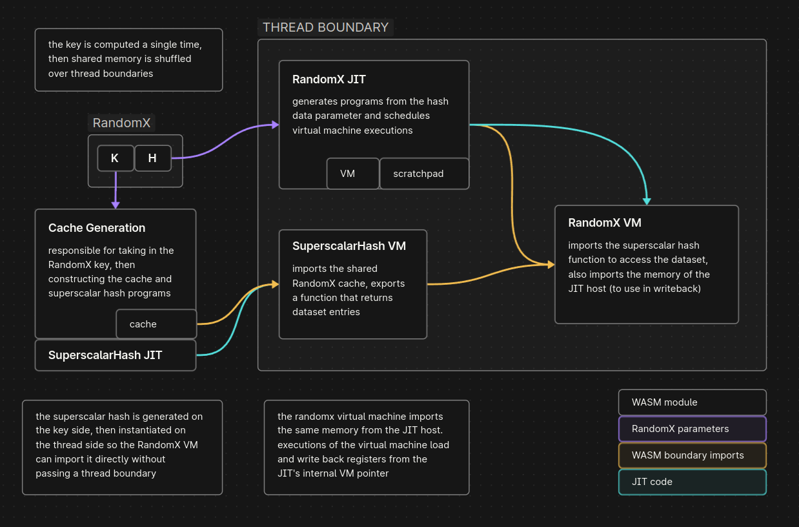

# RandomX.js

[RandomX.js](https://github.com/l1mey112/randomx.js) ([NPM](https://www.npmjs.com/package/randomx.js)) | [RandomWOW.js](https://github.com/l1mey112/randomx.js/tree/randomwow) ([NPM](https://www.npmjs.com/package/randomwow.js))

**RandomX.js is an implementation of the ubiquitous Monero POW algorithm RandomX in JavaScript.** Theorised by its creator and others to be near impossible to run on JS with only web standards, hashes are computed just fine. This is an attempt to build a RandomX implementation that is as fast as possible, compliant with the RandomX specification, simple to read and understand, and matches the reference API as closely as possible.

```ts
// npm i randomx.js
import { randomx_create_vm, randomx_init_cache } from 'randomx.js'

const cache = randomx_init_cache('optional key')
const randomx = randomx_create_vm(cache)

console.log(randomx.calculate_hash('hello world')) // Uint8Array
```

> [RandomX](https://github.com/tevador/RandomX) is a proof-of-work (PoW) algorithm that is optimized for general-purpose CPUs. RandomX uses random code execution (hence the name) together with several memory-hard techniques to minimize the efficiency advantage of specialized hardware.

```bash
PRODUCTION=1 scripts/build.ts
node examples/randomx.js
# JIT using: baseline + relaxed-simd
# cache construction time 535.8 ms
# average hashrate: 22.0 H/s

bun examples/randomx.js
# JIT using: baseline
# cache construction time 1071.8 ms
# average hashrate: 14.1 H/s

node examples/randomx_threaded.js
# JIT using: baseline + relaxed-simd
# initialising thread 0..15
# average hashrate: 208.0 H/s

node examples/mining/server.js
# server running at http://localhost:8080/
# JIT using: baseline + relaxed-simd
# average hashrate: 137.0 H/s

node -v; bun -v; chromium --version
# v22.9.0
# 1.1.29
# Chromium 128.0.6613.119 Arch Linux
```

Hashrate was speculated to be 1 H/s per thread, this beats it at still a pitiful 20 H/s. On the same machine, 100 H/s per thread is achieved when mining in light/verification mode, so 5x slower ain't that bad. Mining with an initialised dataset (2 GiB allocation) is not supported (though easy to implement), no one on earth would give a webpage multiple gigabytes of memory. **Light/verification mode only, transparent threading is enabled by allocating the cache with the `shared` parameter.**

Appreciate the undertaking? Consider a donation.

| Crypto  | Donation Address |
| ------------- | ------------- |
| XMR  | 85vt1KvVz82Dd7AoVWXxnPCubutVT9NRNTAoxKFnXNpzcUfLFZ7rBtjbxonPTD5roE998XczLAoCrUD7tPS84AUQ8cZXHRM |
| WOW  | WW3asfacxETEgtUFVXGBfnJUqmMgNrVdWJTDouT63Ly4B1B9xiqj2g6bDPS8jZNn6pXY5pj4dnmTtL1gLRTAxXwz1LQhsua1R |

## Implmentation

This codebase can be used to learn about RandomX, and its individual stages implemented with simple code. The library contains zero JavaScript dependencies, with pure freestanding C code that doesn't depend on a standard library. **All C++ code has been reimplemented or removed. C++ is a cancer that made the original library impossible to understand in one piece.**



Virtual machine executions use a JIT compiler ([superscalarhash](src/jit/jit_ssh.c), [randomx](src/jit/jit_vm.c)) to generate WASM on the fly, **the library does not use an interpreter.** The SuperscalarHash function can be used separately, with its implementation also being JIT code. To generate hashes the library calls into the JIT which hands back the code, which is then executed, repeating up till `RANDOMX_PROGRAM_COUNT` ([JS entrypoint](src/vm/vm.ts)).

- Example [RandomX Virtual Machine](media/randomx.wat) JIT code
- Example [SuperscalarHash](media/superscalarhash.wat) JIT code

Vector instructions are used where possible in the library ([argon2](src/argon2fill/argon2fill_v128.c), [semifloat](src/jit/stubs/semifloat.c)) and in JIT code, and AES-NI rounds are emulated in software ([softaes](src/aes/softaes.c)).

RandomX requires the use of multiple floating point rounding modes adjustable during VM execution, which are not supported in JavaScript. Performant emulations ([semifloat](src/jit/stubs/semifloat.c)) are used in place of these, which I am not opting to call "softfloat". A better name for these would be "semifloat", as they implement the rounding modes in terms of floating point operations rounded to nearest, not a typical softfloat that implements floating point using only integer operations. This libraries semifloat implementation is rigorously tested, with a 200k LOC test suite ([harness](tests/semifloat/semifloat_test.c)).

The library is entirely compliant with reference implementation, and all components been tested properly ([tests](tests), [harness](tests/harness.c), [harness wrapper](tests/harness.ts)). Reaching compliance was done by single stepping the virtual machine and diffing the state with the reference implementation ([breakpoint function](src/vm/vm.c), [JIT instrumentation](src/jit/jit_vm_inst.c)).

